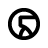
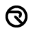
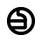
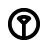

# Deechi <!-- omit in toc -->

Deechi is a monospaced font based on the [Umbara Alphabet](https://starwars.fandom.com/wiki/Umbara_alphabet). The font includes 30 letters, 10 digits, and 13 punctuation symbols.

- [Overview](#overview)
- [Download \& Install](#download--install)
- [Copyright Notice](#copyright-notice)
- [Details](#details)
  - [Letters](#letters)
  - [Digits](#digits)
  - [Punctuation](#punctuation)

## Overview

## Download & Install

You can download the latest version by clicking this link: [Download Deechi](https://github.com/brokenarc/deechi/releases/latest/download/deechi.zip)

The download contains the font in `.otf` format for use on Windows, macOS, and Linux. Consult your operating system's documentation for guidance on how to install fonts.

Web font versions in `.woff` and `.woff2` are also provided. You can learn how to use web fonts on [Mozilla's web fonts page](https://developer.mozilla.org/en-US/docs/Learn/CSS/Styling_text/Web_fonts).

## Copyright Notice

Star Wars, Umbara, and the Umbara glyph designs are the exclusive property of LucasFilm Ltd.

This project is a fair use fan work intended for use by cosplayers, LARPers, and TTRPG players. The font binaries and graphic source files are offered under [The Unlicense](https://unlicense.org), and it is the user's responsibility to ensure that their usage of them respects LucasFilm Ltd.'s intellectual property rights.

## Details

### Letters

The core letter set is mapped to the lowercase Latin characters `a`-`z`. Four additional letter-like symbols do not have an established mapping. These are mapped to `+`, `@`, `=`, and `*` in this font; this will be updated once they have an established mapping.

| Glyph                                  | Name    | Key Mapping | Unicode Mapping |
| -------------------------------------- | ------- | ----------- | --------------- |
|        | a       | `a`         | `U+0061`        |
|        | b       | `b`         | `U+0062`        |
|        | c       | `c`         | `U+0063`        |
|        | d       | `d`         | `U+0064`        |
|        | e       | `e`         | `U+0065`        |
|        | f       | `f`         | `U+0066`        |
|        | g       | `g`         | `U+0067`        |
|        | h       | `h`         | `U+0068`        |
|        | i       | `i`         | `U+0069`        |
|        | j       | `j`         | `U+006A`        |
|        | k       | `k`         | `U+006B`        |
|        | l       | `l`         | `U+006C`        |
|        | m       | `m`         | `U+006D`        |
|        | n       | `n`         | `U+006E`        |
|        | o       | `o`         | `U+006F`        |
|        | p       | `p`         | `U+0070`        |
|        | q       | `q`         | `U+0071`        |
|        | r       | `r`         | `U+0072`        |
|        | s       | `s`         | `U+0073`        |
|        | t       | `t`         | `U+0074`        |
|        | u       | `u`         | `U+0075`        |
|        | v       | `v`         | `U+0076`        |
|        | w       | `w`         | `U+0077`        |
|        | x       | `x`         | `U+0078`        |
|        | y       | `y`         | `U+0079`        |
|        | z       | `z`         | `U+007A`        |
|  | Unknown | `+`         | `U+002B`        |
|  | Unknown | `@`         | `U+0040`        |
|  | Unknown | `=`         | `U+003D`        |
|  | Unknown | `*`         | `U+002A`        |

### Digits

The standard digits are mapped to the Arabic numerals `0`-`9`.

| Glyph                            | Name  | Key Mapping | Unicode Mapping |
| -------------------------------- | ----- | ----------- | --------------- |
|  | Zero  | `0`         | `U+0030`        |
|  | One   | `1`         | `U+0031`        |
|  | Two   | `2`         | `U+0032`        |
|  | Three | `3`         | `U+0033`        |
|  | Four  | `4`         | `U+0034`        |
|  | Five  | `5`         | `U+0035`        |
|  | Six   | `6`         | `U+0036`        |
|  | Seven | `7`         | `U+0037`        |
|  | Eight | `8`         | `U+0038`        |
|  | Nine  | `9`         | `U+0039`        |

### Punctuation

Seven core punctuation symbols have known mappings: `|`, `/`, `?`, `!`, `-`, `,`, and `.`.

Six additional punctuation-like symbols do not have an established mapping. These are mapped and are mapped to `(`, `[`, `{`, `}`, `]`, and `)` in this font; this will be updated once they have an established mapping.

| Glyph                                             | Name               | Key Mappings | Unicode Mappings |
| ------------------------------------------------- | ------------------ | ------------ | ---------------- |
|        | Vertical bar       | `\|`         | `U+007C`         |
|     | Slash (solidus)    | `/`          | `U+002F`         |
|       | Question Mark      | `?`          | `U+003F`         |
|    | Exclamation Mark   | `!`          | `U+0021`         |
|        | Hyphen-minus       | `-`          | `U+002D`         |
|               | Comma              | `,`          | `U+002C`         |
|  | Full Stop (period) | `.`          | `U+002E`         |
|             | Unknown            | `(`          | `U+0028`         |
|             | Unknown            | `[`          | `U+005B`         |
|             | Unknown            | `{`          | `U+007B`         |
|             | Unknown            | `}`          | `U+007D`         |
|             | Unknown            | `]`          | `U+005D`         |
|             | Unknown            | `)`          | `U+0029`         |
